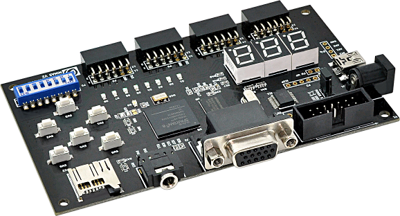

## Welcome to FPGA MicroPython (FμPy)

]

* [MicroPython](http://micropython.org/)
* [FPGA](https://en.wikipedia.org/wiki/Field-programmable_gate_array)

The aim of this project is to make MicroPython run on FPGAs using the [LiteX](https://github.com/enjoy-digital/litex) & [Migen+MiSoC](http://m-labs.hk/gateware.html) technologies. This allows you to do full stack development (FPGA gateware & soft CPU firmware) in Python!

Our MicroPython fork is at:

[https://github.com/fupy/micropython](https://github.com/fupy/micropython)

with the port files in `ports/fupy`.

## Gateware

`Gateware` is the name we use for the hardware code that is loaded onto the FPGA that MicroPython runs on.

For MicroPython development we use a the [TimVideos
`litex-buildenv`](https://github.com/timvideos/litex-buildenv/) from the
[TimVideos Project](https://code.timvideos.us/home/), which also produces
[HDMI2USB](https://hdmi2usb.tv/).

## Getting Started

 * Aug 2018 - [HowTo FμPy on Digilent Arty A7](https://github.com/timvideos/litex-buildenv/wiki/HowTo-FuPy-on-a-Digilent-Arty-A7)

 * Jan 2018 -- [long blog post with instructions for Numato Mimas v2 and
   Digilent Arty A7](https://ewen.mcneill.gen.nz/blog/entry/2018-01-17-fupy-fpga-micropython-on-mimas-v2-and-arty-a7/),
   using `timvideos/litex-buildenv`.

### Developing in MicroPython environment

 * get lm32 toolchain
 * git clone https://github.com/fupy/micropython.git
 * cd litex
 * Download prebuilt gateware + headers using `get-gateware.sh`
 * Compile micropython
 * Load micropython

### Developing in the `litex-buildenv` environment

 1. Follow [getting started instructions](https://github.com/fupy/upy-fpga-litex-gateware/blob/master/getting-started.md) to setup gateware environment.
 2. Enter the gateware environment with ./scripts/enter-env.sh
 3. Set PLATFORM and TARGET correctly - eg
    "export PLATFORM=mimasv2" if using the MimasV2
 4. Build the gateware with `make gateware`
 5. Run `./scripts/build-micropython.sh`

This will give you an image for your target at `./build/$PLATFORM_$TARGET_lm32/micropython.bin` which you can then flash to your board.

#### Running MicroPython inside QEmu environment

The `litex-buildenv` LiteX environment provides some limited QEmu emulation of the FPGA gateware, this means you can test your code without needing hardware.

It can be used with the MicroPython image by running `./scripts/build-qemu.sh` and then replacing `-kernel qemu.bin` with `-kernel micropython.bin` in the last command.

See the [TimVideos' QEmu for LiteX GitHub Repo](https://github.com/timvideos/qemu-litex/blob/master/README.md)

## More Information

 * [Wiki](https://github.com/fupy/issues-wiki/wiki)
 * [GitHub Issues](https://github.com/fupy/issues-wiki/issues)

## Contact

 * [MicroPython on FPGA Mailing List](https://groups.google.com/forum/#!forum/fupy/join)
 * [MicroPython on FPGA Chat Channel, #fupy on FreeNode](irc://irc.freenode.net/#fupy) ([WebChat](https://webchat.freenode.net/?channels=#fupy))

## Current Targets

### Hardware Targets

 * [Arty A7](https://store.digilentinc.com/arty-a7-artix-7-fpga-development-board-for-makers-and-hobbyists/) -- $100 USD, Artix 7 board with DDR memory

 * [MimasV2](http://numato.com/mimas-v2-spartan-6-fpga-development-board-with-ddr-sdram/) - $50 USD, Spartan 6 board with DDR memory. 

 * Future [FPGA MicroPython targets are documented in this spreadsheet](https://docs.google.com/spreadsheets/d/1XTHfdYXuvwoYdPXm4M6qDA0D2fZCPy220-9q6qZpTw4/edit#gid=0).
 
### Software Targets

These targets don't need any physical hardware and are good for testing / developing.

 * [LiteX QEmu emulation](https://github.com/shenki/qemu-litex) (see [MicroPython on FPGAs Wiki Page](https://github.com/shenki/micropython/wiki/Micropython-on-FPGAs) for notes on getting started)
 * [Verilator Verilog Simulator](https://www.veripool.org/wiki/verilator)
